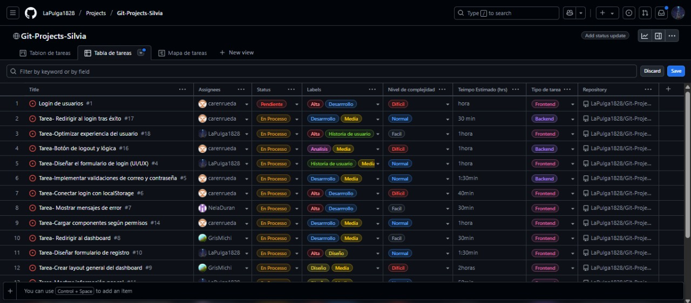
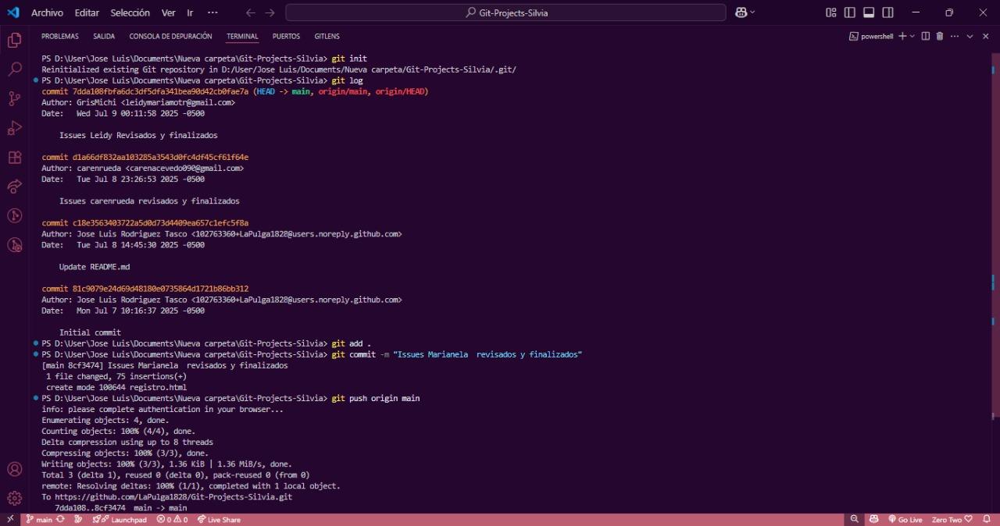
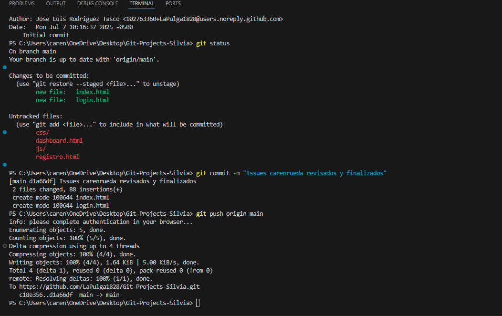
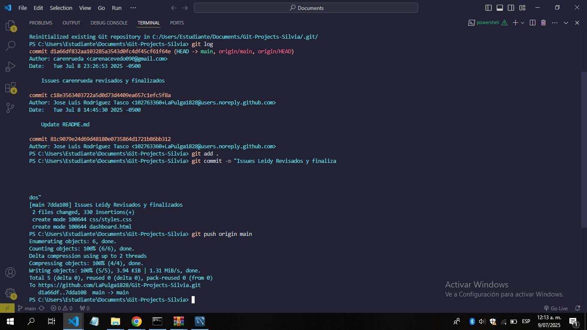
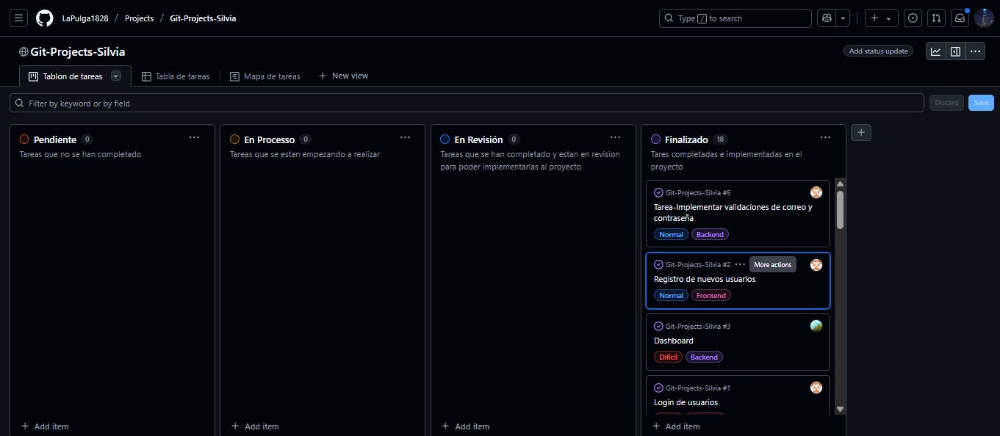
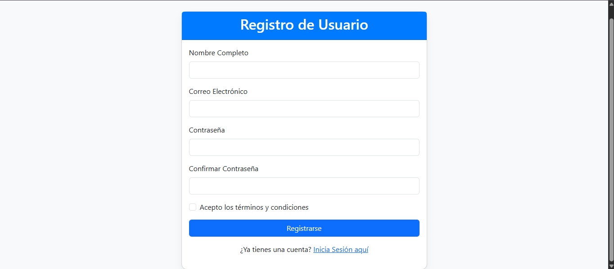
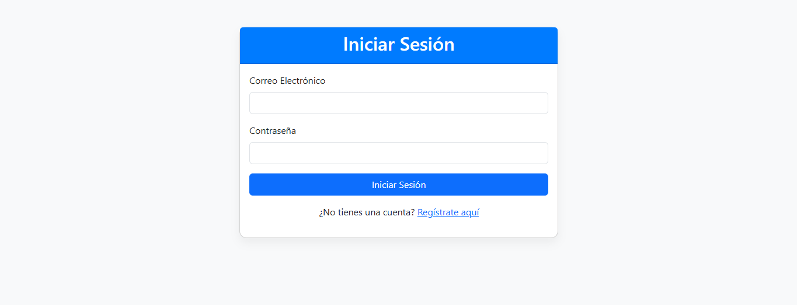
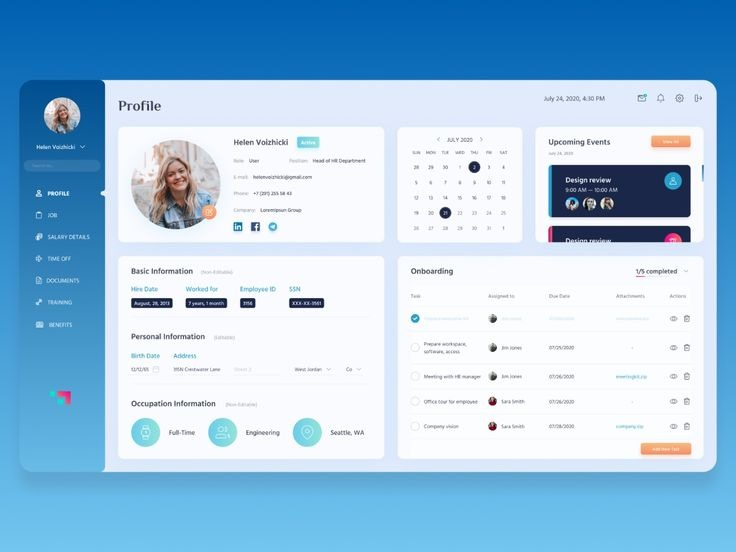

# 🧠 Git-Projects-Silvia

Este es un proyecto académico colaborativo donde desarrollamos un sitio web que permite a los usuarios registrarse, iniciar sesión y acceder a un panel principal (dashboard). Es un sitio funcional con páginas estáticas y manejo básico de autenticación desde el DOM y localStorage.

## 🚀 Objetivo

Desarrollar un módulo de autenticación con tres componentes principales:

- Registro de usuario
- Inicio de sesión
- Dashboard estático accesible solo al iniciar sesión

El proyecto no tiene backend ni base de datos. Se usará DOM, JavaScript y almacenamiento local (localStorage) para gestionar los usuarios.

---

## 👥 Integrantes del equipo

| Nombre | Rol asignado |
|--------|--------------|
| Leidy Maria Morales | Diseño UI + Registro |
| Caren Rueda | Login + Validaciones |
| Marianela Duran | Dashboard + Redirecciones |
| Jose Luis Rodriguez | DOM + Funcionalidad General |

---

## 🗂️ Estructura de Archivos

- index.html – Página de inicio (landing)
- registro.html – Formulario de registro
- login.html – Formulario de login
- dashboard.html – Página protegida
- js/
  - auth.js – Lógica de login y registro
  - utils.js – Validaciones y manejo DOM
- css/
  - styles.css – Estilos globales

---

## 📌 Historias de Usuario

✔️ Como usuario registrado quiero iniciar sesión con mi correo y contraseña para acceder al panel.

✔️ Como nuevo usuario quiero registrarme proporcionando mi información personal para poder usar la app.

✔️ Como usuario autenticado quiero ver el dashboard con contenido básico cuando inicio sesión correctamente.

---

## 🧩 Tablero del Proyecto

Usamos GitHub Projects para organizar el desarrollo:

🔗 Tablero: https://github.com/LaPulga1828/Git-Projects-Silvia/projects/1

Columnas:

- Pendiente
- En Proceso
- En Revisión
- Finalizado

Cada historia tiene sub-tareas asignadas y responsables definidos.

---

## 🛠 Tecnologías

- HTML5
- CSS3
- JavaScript (Vanilla)
- Bootstrap (opcional)
- DOM API
- localStorage

---

## 📷 Capturas de Evolucion del repositorio del Proyecto

---

---

## 📷 Capturas del Proyecto

Imágenes del diseño final y estructura.

---

## ✅ Instrucciones para probar

1. Clona el repositorio:  
   git clone https://github.com/LaPulga1828/Git-Projects-Silvia.git

2. Abre index.html con tu navegador

3. Regístrate, inicia sesión y accede al dashboard

---

## 🧠 Conclusión

Este proyecto simula un sistema de autenticación sin backend usando solo JavaScript y DOM. Ideal para entender el flujo completo de interacción desde el frontend.

